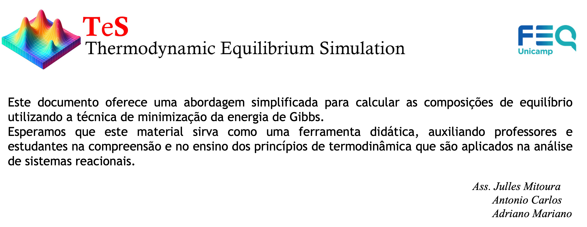

Como exemplo, verificaremos o processo de reforma a vapor de metano.

```python
"""
Componentes considerados:

H2O
CH4
CO2
CO
H2

"""
```
---
### Parte 01: Dados de entrada sobre os componentes químicos envolvidos

* Calculo das capacidades caloríficas

O polinômio utilizado para o cálculo das capacidades caloríficas é apresentado abaixo:

$$\frac{C_p}{R} = a + b.T + c.T^2 + \frac{D}{T^2}$$

Essa informação será relevante para o cálculo da energia de Gibbs padrão de formação em função da temperatura.

As informações para o cálculo das capacidade caloríficas foram obtidas do livro Introduction of Chemical Engineering Thermodynamics. Estas são apresentadas abaixo:

```python
# Valores de Cp 

         # CPA, CPB, CPC, CPD
CP_data = [[3.47,0.00145,0,12100],               # H2O
           [1.702,0.009081,-0.000002164,0],      # CH4
           [5.457,0.001045,0,-115700],           # CO2
           [3.376,0.000557,0,-3100],             # CO
           [3.249,0.000422,0,8300]]              # H2

```

* Propriedades termodinâmicas de formação
  
```python
# Informações obtidas do livro Introduction of Chemical Engineering Thermodynamics
# deltaH - Entalpia de formação a 298.15 K (J/mol)
# deltaG - Energia de Gibbs de formação a 298.15 K (J/mol)

           # deltaH, deltaG
prop_form = [[-241818,-228572],    # H2O
             [-74520,-50460],      # CH4
             [-393509,-394359],    # CO2
             [-110525,-137169],    # CO
             [0, 0]]               # H2
```

* Propriedades críticas termodinâmicas dos componentes puros

```python
# Informações obtidas do livro Introduction of Chemical Engineering Thermodynamics
# Tc - Temperatura crítica (K)
# Pc - Pressão crítica (bar)
# omega - fator acentrico (-)

            # Pc,     Tc,  omega
prop_term = [[220.55,647.1,0.345],    # H2O
             [45.99,190.6,0.012],     # CH4
             [73.83,304.2,0.224],     # CO2
             [34.99,132.9,0.048],     # CO
             [13.13,33.19,-0.216]]    # H2
```
---
### Parte 02: Calculo da energia de Gibbs

Até este ponto fizemos a inserção das informações necessárias para os cálculos que faremos com o objetivo de minimizar a energia de Gibbs dos sistema.

Como já dito, o objetivo é minimizar a energia de Gibbs e esta será escrita na forma de programação não-linear como apresenta a equação abaixo:

$$min G = \sum_{i=1}^{NC} \sum_{j=1}^{NF} n_i^j \mu_i^j$$

Tendo as informações apresentadas na **Parte 01**, agora faremos o cálculo da energia de Gibbs. A equação abaixo apresentação a realção entra entalpia e capacidade calorífica.

$$\frac{\partial \bar{H}_i^g}{\partial T} = Cp_i^g \text{  para } i=1,\ldots,NC$$

Tendo conhecimento da realação da entalpia com a temperatura, o passo seguinte é o cálculo do potencial químico. A equação abaixo apresenta a correlação para o cálculo dos potenciais químicos.

$$\frac{\partial}{\partial T} \left( \frac{\mu_i^g}{RT} \right) = -\frac{\bar{H}_i^g}{RT^2} \quad \text{para } i=1,\ldots,NC$$

Assim, a função abaixo (**gibbs_pad**) calcula os potenciais químicos.

```python
from scipy.integrate import quad

def gibbs_pad(T, prop_form, CP_data):
    R = 8.314  # J/mol·K
    T0 = 298.15  # Temperatura de referência em Kelvin
    
    results = []

    # Itera sobre as propriedades de formação e os dados de Cp juntos
    for (deltaH, deltaG), (CPA, CPB, CPC, CPD) in zip(prop_form, CP_data):
        # Define a função Cp(T_prime) com base nos dados de CP
        def cp(T_prime):
            return R * (CPA + CPB * T_prime + CPC * T_prime ** 2 + CPD / T_prime ** 2)

        # Inner integral
        def inner_integral(T_prime):
            value, _ = quad(cp, T0, T_prime)
            return (deltaH + value) / T_prime ** 2

        # Outer integral
        integral_value, _ = quad(inner_integral, T0, T)
    
        # Calculating mu_i using the provided formula
        mu_i = T * (deltaG / T0 - integral_value)
        
        results.append(mu_i)

    return results

```

A função acima faz o seguinte:

$$\mu _i^0 = \frac {T}{T^0}.\Delta G_f^{298.15 K} - T.\int_{T_0}^{T} \frac {\Delta H_f^{298.15 K} + \int_{T_0}^{T} (CPA + CPB \cdot T + CPC \cdot T^2 + \frac{CPD}{T^2}) \, dT}{T^2} dT$$
